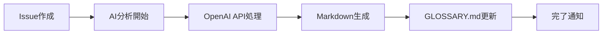

# 🚀 AI用語集システム セットアップガイド

## 📋 **前提条件**

- GitHubリポジトリ（このプロジェクト）
- OpenAI APIキー（GPT-4o-miniを使用、月額$10-20程度）

## ⚡ **5分でできるセットアップ**

### 1️⃣ **OpenAI APIキーの準備**

1. [OpenAI Platform](https://platform.openai.com)にアクセス
2. APIキーを作成（$5以上チャージ推奨）
3. APIキーをコピー（`sk-...`で始まる文字列）

### 2️⃣ **GitHubでのシークレット設定**

1. このリポジトリの `Settings` → `Secrets and variables` → `Actions`
2. `New repository secret` をクリック
3. 名前：`OPENAI_API_KEY`
4. 値：コピーしたOpenAI APIキー
5. `Add secret` をクリック

### 3️⃣ **GitHub Actionsの有効化**

1. リポジトリの `Actions` タブをクリック
2. 「I understand my workflows, go ahead and enable them」をクリック

## 🎉 **完了！使い方**

### **用語の追加方法**

1. リポジトリの `Issues` タブをクリック
2. `New issue` → 「📖 用語追加・編集」を選択
3. フォームに入力：
   - **用語名**: 例「メイドロイド」
   - **説明**: 自由な文章で説明
   - **その他**: わかる範囲で入力
4. `Submit new issue` をクリック

### **AI処理の流れ**



**処理時間**: 通常1-2分

## 📖 **実際の例**

### **入力例（Issue）**
```
用語名: メイドロイド
説明: 家事のお手伝いをしてくれるアンドロイドです。
首の後ろにカセットを挿入できます。充電は5時間かかります。
大学生がバイトのお金で買えるくらいの値段です。
```

### **出力例（AI生成）**
```markdown
# メイドロイド

家事のお手伝いをしてくれるアンドロイドです。首の後ろにデータカセットを挿入することで機能を拡張でき、充電には5時間ほどを要します。

## 基本情報
**カテゴリ**: ハードウェア
**関連用語**: データカセット、ミニマルコンピュータ、TRANS-S

## 詳細
- **価格帯**: 大学生のアルバイト代で購入可能なレベル
- **充電時間**: 約5時間
- **拡張性**: 首の後ろのカセット挿入口で機能追加可能
```

## 🔧 **カスタマイズ**

### **カテゴリの追加**

[`.github/ISSUE_TEMPLATE/terminology.yml`](../.github/ISSUE_TEMPLATE/terminology.yml) の `category` セクションを編集

### **AI処理の調整**

[`.github/workflows/ai-terminology.yml`](../.github/workflows/ai-terminology.yml) の `prompt` セクションを編集

## 💰 **コスト試算**

| 利用規模 | 月額コスト |
|----------|-----------|
| 10用語/月 | $1-3 |
| 50用語/月 | $5-10 |
| 200用語/月 | $15-25 |

## 🆘 **トラブルシューティング**

### **AI処理が動かない**
- `OPENAI_API_KEY` が正しく設定されているか確認
- GitHub Actionsが有効化されているか確認
- OpenAI APIの残高を確認

### **Issue テンプレートが表示されない**
- ブラウザのキャッシュをクリア
- リポジトリの権限を確認

### **生成された内容を修正したい**
- 同じ用語で新しいIssueを作成
- または直接 `GLOSSARY.md` を編集してプルリクエスト

## 🎯 **活用のコツ**

1. **初回は詳しく書く**: AIが学習して次回からより良い出力をします
2. **関連用語も記載**: 用語間のつながりを自動で作成します  
3. **遠慮しないで投稿**: 間違いがあってもAIが修正・改善します

## 📈 **将来の拡張予定**

- [ ] 用語間の自動リンク生成
- [ ] 重複検出・マージ機能
- [ ] GitHub Wiki自動更新
- [ ] 多言語対応
- [ ] 画像・図表の自動生成

---

これで技術に詳しくないユーザーでも簡単に高品質な用語集を作成できます！